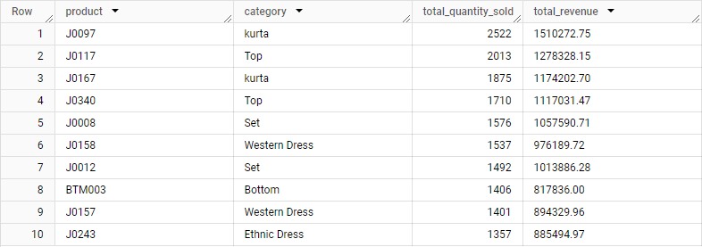

# Project Analisis Data - Amazon Sales Report

## Deskripsi Project
Project ini bertujuan untuk menganalisis data penjualan dari laporan Amazon dengan menggunakan DBT (Data Build Tool) dan BigQuery. Skema bintang (Star Schema) dibangun dengan tabel dimensi dan tabel fakta untuk menghasilkan analisis yang relevan.

## Tabel yang Dibuat
### Tabel Dimensi
1. **dim_fulfilment**
   - Menyimpan informasi tentang metode pemenuhan dan pihak yang memenuhi.
   - File: [dim_fulfilment.sql](.dbt/models/fulfilment/dim_fulfilment.sql)

2. **dim_product**
   - Menyimpan detail produk, termasuk style, SKU, kategori, dan ukuran.
   - File: [dim_product.sql](.dbt/models/product/dim_product.sql)

3. **dim_promotion**
   - Menyimpan informasi promosi yang terkait dengan produk.
   - File: [dim_promotion.sql](.dbt/models/promotion/dim_promotion.sql)

4. **dim_sales_shipment**
   - Menyimpan detail pengiriman, termasuk status kurir dan alamat pengiriman.
   - File: [dim_sales_shipment.sql](.dbt/models/shipment/dim_sales_shipment.sql)

5. **dim_sales_channel**
   - Menyimpan informasi tentang saluran penjualan.
   - File: [dim_sales_channel.sql](.dbt/models/sales_channel/dim_sales_channel.sql)

### Tabel Fakta
1. **fact_salesorder**
   - Menyimpan informasi tentang pesanan penjualan, termasuk tanggal, jumlah, dan pendapatan.
   - File: [fact_salesorder.sql](.dbt/models/fact/fact_salesorder.sql)

## Entity-Relationship Diagram (ERD)
Diagram ERD yang menggambarkan hubungan antara tabel dimensi dan tabel fakta dalam skema bintang:

## Analisis Data: Top Selling Products
Analisis ini menunjukkan produk terlaris berdasarkan jumlah penjualan dan pendapatan:

### Hasil Analisis

## Screenshot yang Diambil
Berikut adalah daftar screenshot yang diambil untuk dokumentasi:
1. **Upload Data ke BigQuery**
   - 

2. **Membangun Tabel Dimensi (dim_fulfilment)**
   - 
   - 
   - 

3. **Membangun Tabel Dimensi (dim_product)**
   - 
   - 
   - 

4. **Membangun Tabel Dimensi (dim_promotion)**
   - 
   - 
   - 

5. **Membangun Tabel Dimensi (dim_sales_shipment)**
   - 
   - 
   - 

6. **Membangun Tabel Dimensi (dim_sales_channel)**
   - 
   - 
   - 

7. **Membangun Tabel Fakta (fact_salesorder)**
   - 
   - 
   - 

8. **ERD Star Schema**
   - 

9. **Query Analisis Top Selling Products**
   - 
   - 

## Penutup
Dokumentasi ini merangkum langkah-langkah yang diambil dalam Project analisis data menggunakan DBT dan BigQuery. Hasil analisis ini diharapkan dapat memberikan wawasan yang berguna dalam memahami kinerja produk di platform Amazon.
